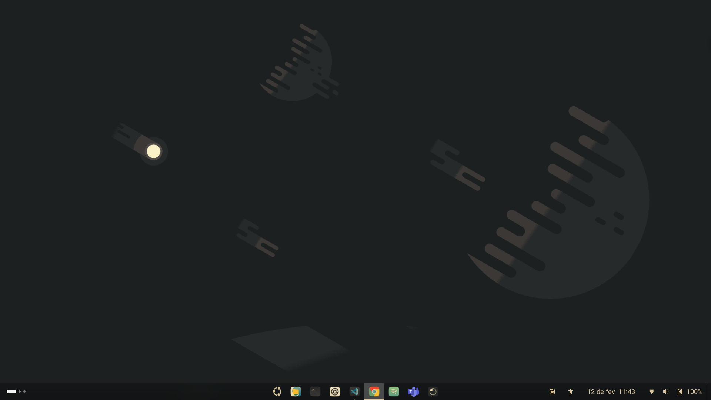
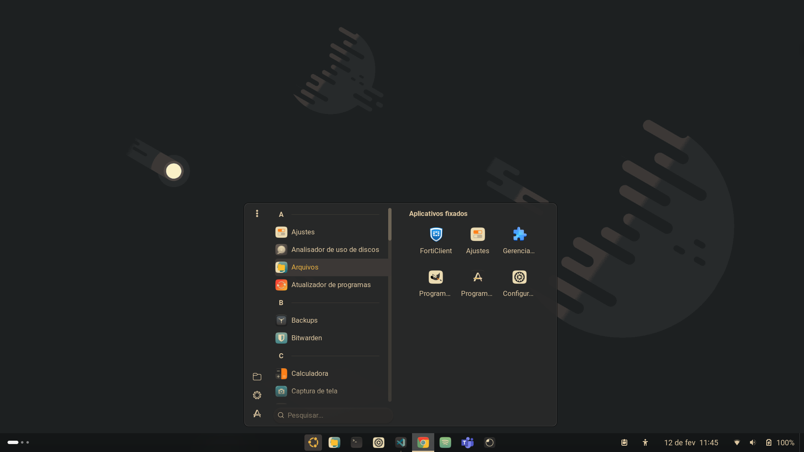
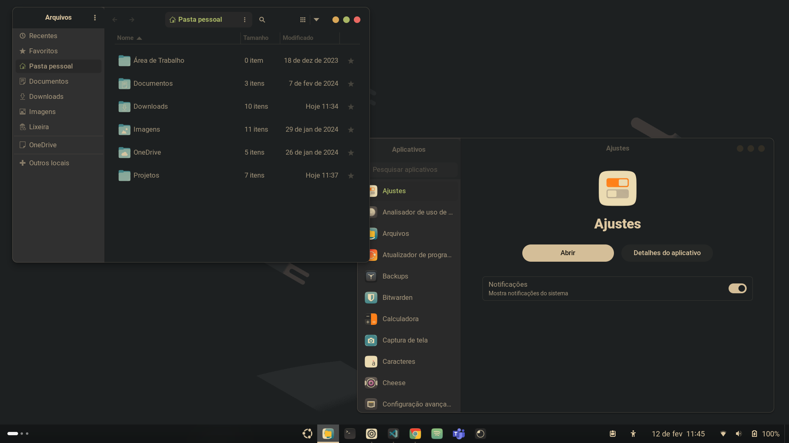
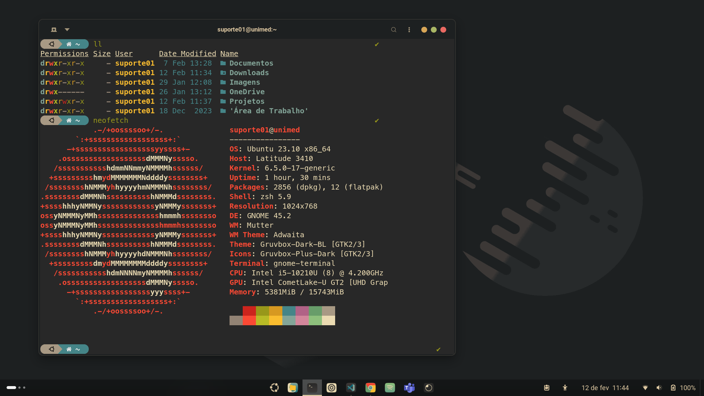
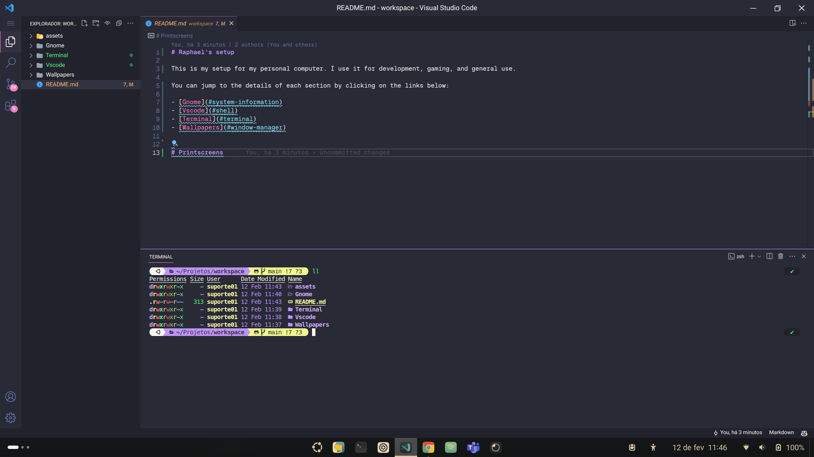

# Raphael's setup

    This is my setup for my personal computer. I use it for development, gaming, and general use.

  You can jump to the details of each section by clicking on the links below:

- [Gnome](Gnome/README.md)
- [Vscode](Vscode/README.md)
- [Terminal](Terminal/README.md)
- [Wallpapers](Wallpapers/README.md)

### Gnome

### Terminal

### Vscode

                                                                                                                    
