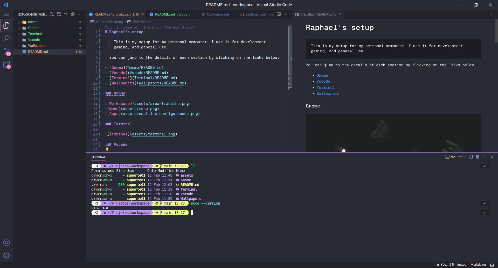

# VSCODE

## Themes

- [Dracula Refined](https://marketplace.visualstudio.com/items?itemName=mathcale.theme-dracula-refined)

- [Material Icon Theme](https://marketplace.visualstudio.com/items?itemName=PKief.material-icon-theme)

## Configuration file

[View here my settings.json](assets/settings.json)

## Snippets

[View here my snippets](assets/snippets.json)

## Fonts

Download and install the GeistMono font

Font folder: [GeistMono](assets/Fonts/GeistMono)

or you can download the zip file and extract it on your `.local/share/fonts` folder
[Download the zip file](assets/Fonts/GeistMono.zip)
